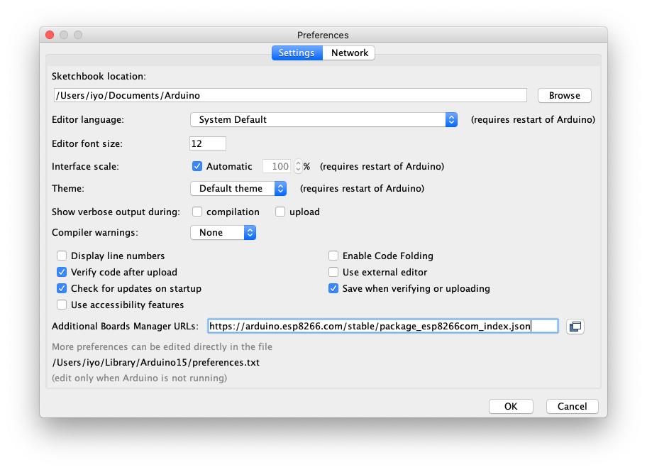
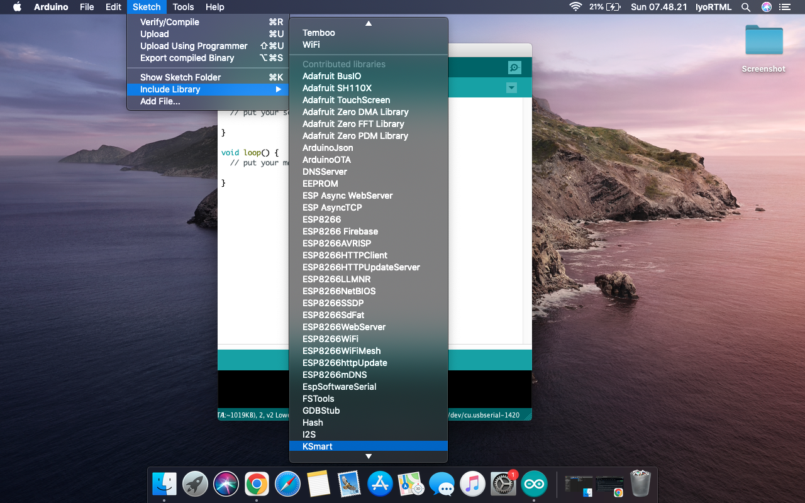

# Hello
KSMART is an abbreviation of Klati Smart which is a development project between Arduino and Android Studio. Like BoT or IoT project that develops remote electrical control.

# Arduino
Arduino is an open-source electronics platform based on easy-to-use hardware and software. Arduino boards are able to read inputs - light on a sensor, a finger on a button, or a Twitter message - and turn it into an output - activating a motor, turning on an LED, publishing something online. You can tell your board what to do by sending a set of instructions to the microcontroller on the board. To do so you use the Arduino programming language (based on Wiring), and the Arduino Software (IDE), based on Processing.

Over the years Arduino has been the brain of thousands of projects, from everyday objects to complex scientific instruments. A worldwide community of makers - students, hobbyists, artists, programmers, and professionals - has gathered around this open-source platform, their contributions have added up to an incredible amount of accessible knowledge that can be of great help to novices and experts alike.

Arduino was born at the Ivrea Interaction Design Institute as an easy tool for fast prototyping, aimed at students without a background in electronics and programming. As soon as it reached a wider community, the Arduino board started changing to adapt to new needs and challenges, differentiating its offer from simple 8-bit boards to products for IoT applications, wearable, 3D printing, and embedded environments - [Arduino](https://docs.arduino.cc/learn/starting-guide/whats-arduino/).

# Board Manage
Add the board url ESP8266, copy paste the url below, add to preferences Arduino.
``` txt
https://arduino.esp8266.com/stable/package_esp8266com_index.json
```
[](Screenshot/ss_001.png)

# Libraries
Download (KSmart)[https://github.com/CusMeDroid/Arduino] and unzip in Arduino/libraries/KSmart. on sketch include libraries KSmart.

[](Screenshot/ss_002.png)

